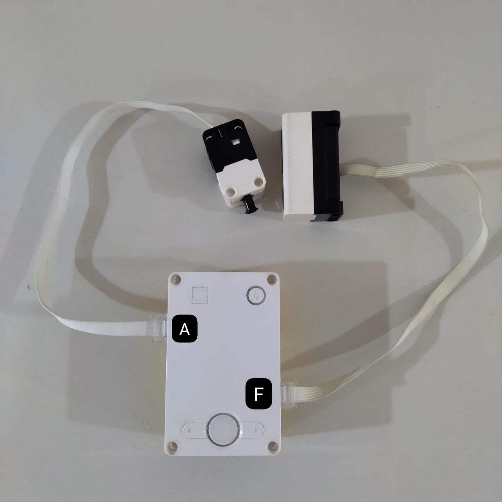
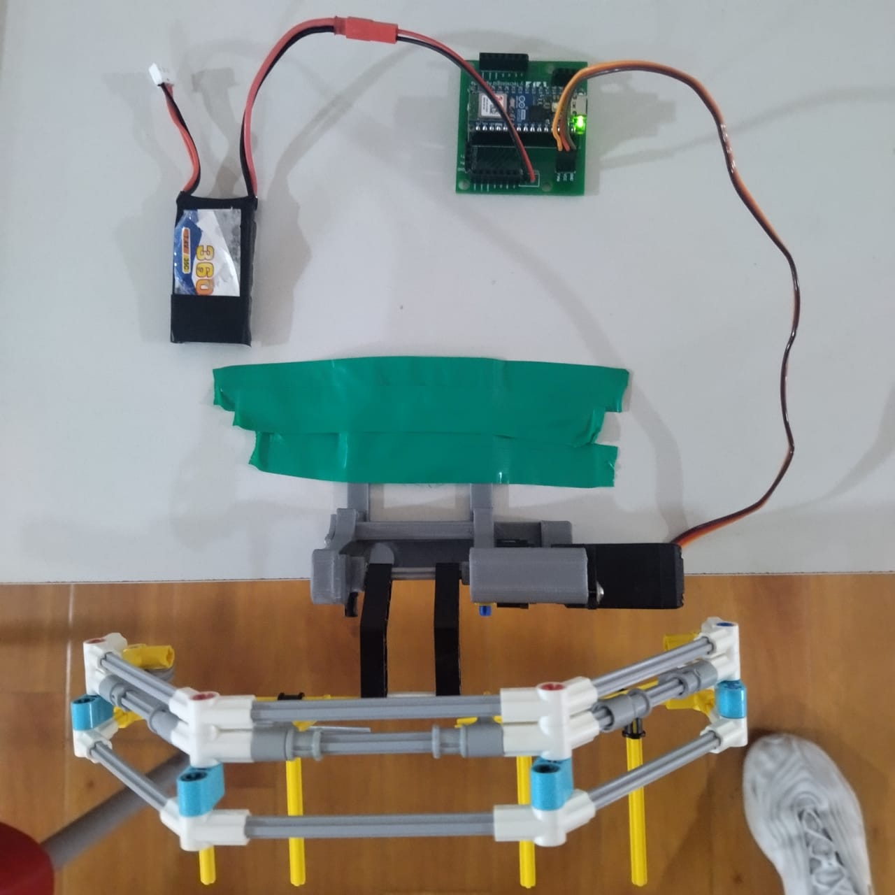

# BLE_Pybricks_ESP32

Este repositorio explica como comunicar una arduino Nano ESP32 con un Lego Spike Prime a travez de BLE.

Con los codigo en el repositorio se puede replicar el siguiente experimento

1 Lego Spike Prime con 2 Sensores:
- Sensor de Tacto: 
    * Conectado en PUERTO --> A
- Sensor de Distancia: 
    * Conectado en PUERTO --> F

Como se ve en la siguiente Imagen

Y una Arduino Nano con un ServoMotor conectado en el PIN 38 --> GPIO (ver pinout micropython)

Como se ve en la siguiente Imagen

El codigo en `code\HUB\test_BLE.py` se sube en el Lego Spike Prime

El codigo en `code\Nano_ESP32\main.py` se sube en la nano esp32

Los codigo proporcionados deberian hacer que al accionar el sensor de tacto en el Spike se envie la orden a la nano esp32 para mover el servomotor a una posicion especifica

Utils Links:

* Documentacion about Nano esp32 --> [Aqui](https://docs.arduino.cc/hardware/nano-esp32/)

* Pinout Nano ESP32 --> [Aqui](https://docs.arduino.cc/resources/pinouts/ABX00083-full-pinout.pdf)

* Ejemplo que seguimos -- >[Aqui](https://pybricks.com/project/micropython-ble-communication/)
